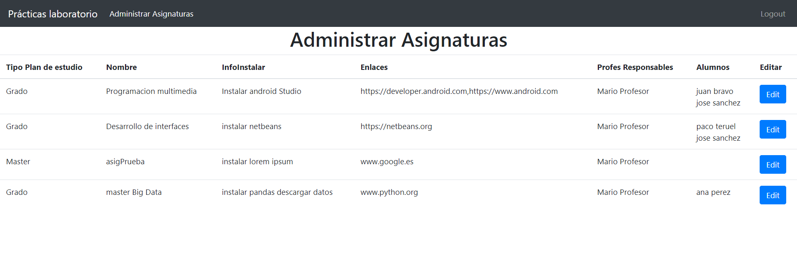
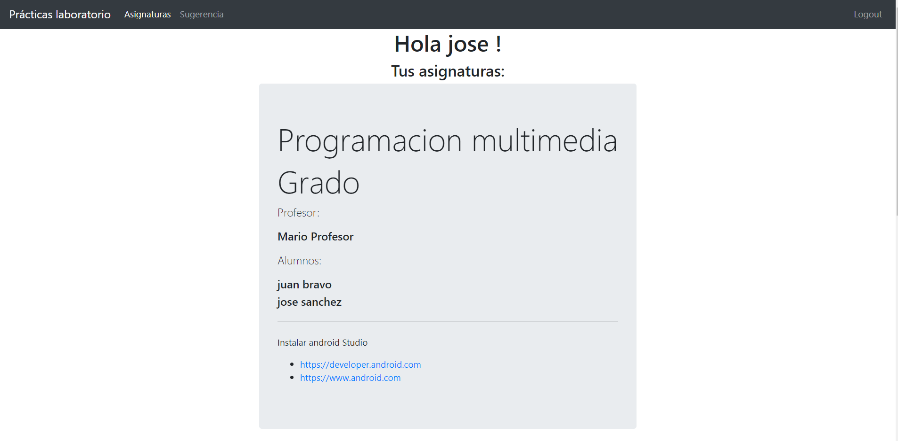

# University-Campus-Node
University campus made with <b>Node.js</b>(<b>EJS templating engine</b>) , <b>Mongoose</b> library using <b>MongoDB Cloud</b>.  
Includes file upload functionality for Teachers.  
There are 3 types of Users: <b>Administrators, teachers and students</b>. Each type of user has it´s own permissions with different functionalities. 
Administrators can edit and add Users and Subjects. 
Teachers can edit their Subjects. 
Students can see their Subjects´ information published by the Teachers. 

## Administrator main page

## Teacher main page

## Student main page

## Steps for running the App

### `npm install`

Install App´s node modules. <strong>Necessary for running the App.</strong>

### `npm start`

Runs the App on a local server, go to localhost:3000.
